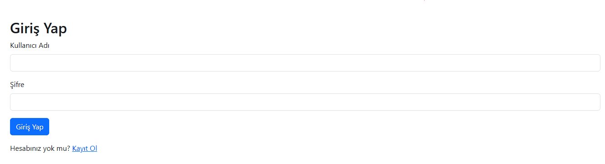
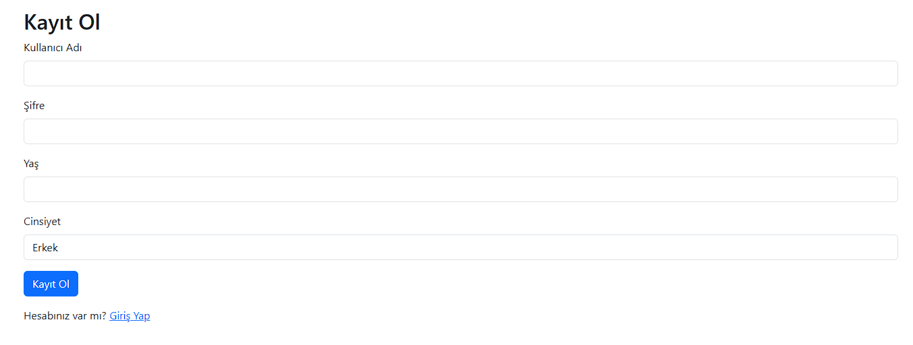
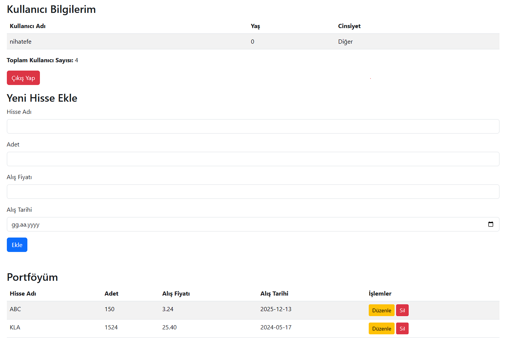

# Koçepe Borsa Yatırım Takip Sistemi

## Proje Hakkında
Koçepe Borsa Yatırım Takip Sistemi, kullanıcıların borsa yatırımlarını yönetmelerine olanak tanıyan bir web tabanlı uygulamadır. Kullanıcılar, sisteme kayıt olup oturum açarak hisse senedi portföylerini oluşturabilir, hisse bilgilerini ekleyebilir, listeleyebilir, düzenleyebilir ve silebilir. Uygulama, yalın PHP ve MySQL kullanılarak geliştirilmiş olup, arayüzde Bootstrap 5.3.0 ile modern ve duyarlı bir tasarım sunulmuştur. Kullanıcı şifreleri güvenli bir şekilde hash'lenerek saklanır ve oturum yönetimi PHP session'lar ile yapılır.

## Özellikler
- Kullanıcı kaydı ve şifreli oturum açma/kapama
- Hisse senedi ekleme (hisse adı, adet, alış fiyatı, alış tarihi)
- Kullanıcı portföyünü listeleme
- Hisse bilgilerini düzenleme ve silme
- Kullanıcı bilgilerini ve toplam kullanıcı sayısını görüntüleme
- Bootstrap 5.3.0 ile tamamen stillendirilmiş duyarlı arayüz
- Güvenli şifre saklama (`password_hash`) ve oturum yönetimi (`session`)

## Gereksinimler
- **PHP**: 7.4 veya üstü
- **MySQL**: 5.7 veya üstü
- **Web Sunucusu**: Apache
- **Bootstrap**: 5.3.0 (CDN üzerinden)
- **Tarayıcı**: Modern tarayıcılar (Chrome, Firefox, Safari vb.)

## Kurulum

### 1. Depoyu Klonlayın
```bash
git clone https://github.com/kullanici/borsa-yatirim-takip.git
```

### 2. Proje Dizinine Gidin
```bash
cd borsa-yatirim-takip
```

### 3. Veritabanını Ayarlayın
- MySQL'de yeni bir veritabanı oluşturun:
  ```sql
  CREATE DATABASE borsatakip;
  ```
- `db_connect.php` dosyasındaki veritabanı ayarlarını güncelleyin:
  ```php
  <?php
  $host = 'localhost';
  $dbname = 'borsatakip';
  $username = 'kullanici_adi';
  $password = 'sifre';
  try {
      $pdo = new PDO("mysql:host=$host;dbname=$dbname", $username, $password);
      $pdo->setAttribute(PDO::ATTR_ERRMODE, PDO::ERRMODE_EXCEPTION);
  } catch (PDOException $e) {
      echo "Bağlantı hatası: " . $e->getMessage();
      exit;
  }
  ?>
  ```
- Veritabanı şemasını içe aktarmak için `borsatakip.sql` dosyasını kullanın:
  ```bash
  mysql -u kullanici_adi -p borsatakip < borsatakip.sql
  ```

### 4. Sunucuyu Başlatın
- Projeyi bir Apache sunucusuna yerleştirin (örneğin, XAMPP veya WAMP ile lokal ortamda).
- Tarayıcıda `http://localhost/borsa-yatirim-takip` adresine gidin.

### Online Erişim
- <a href = "http://95.130.171.20/~st22360859033"> Online olarak sunucudan erişim için tıklayın</a>

## Kullanım
1. **Kayıt Ol**: Ana sayfadaki "Kayıt Ol" bağlantısına tıklayarak kullanıcı adı, şifre, yaş ve cinsiyet bilgilerinizi girerek hesap oluşturun.
2. **Oturum Aç**: Kayıtlı bilgilerinizle giriş yapın. Şifreler `password_hash()` ile güvenli bir şekilde saklanır.
3. **Portföy Yönetimi**:
   - **Hisse Ekle**: "Kullanıcı Paneli"nde hisse adı, adet, alış fiyatı ve tarih bilgilerini girerek portföyünüze hisse ekleyin.
   - **Hisse Listele**: Portföyünüzdeki hisseleri tablo formatında görüntüleyin.
   - **Hisse Düzenle/Sil**: Listedeki hisselerin yanında bulunan "Düzenle" veya "Sil" butonlarını kullanın.
4. **Kullanıcı Listesi**: "Kullanıcı Listesi" sayfasında tüm kullanıcıların bilgilerini görüntüleyin.
5. **Oturumu Kapat**: Sağ üstteki "Çıkış Yap" bağlantısıyla oturumu kapatın.

## Ekran Görüntüleri
- **Ana Sayfa**:<hr> <hr> 
- **Giriş Sayfası**:  <hr>
  <hr>
- **Kayıt Sayfası**:<hr>
  <hr>
- **Kullanıcı Paneli**:  <hr>
  <hr>

## Proje Videosu
Uygulamanın nasıl çalıştığını gösteren 2-3 dakikalık tanıtım videosu:  
[YouTube Bağlantısı](https://www.youtube.com/watch?v=ornek-video-id)  
(Veya: [Google Drive Bağlantısı](https://drive.google.com/file/d/ornek-dosya-id/view?usp=sharing))

## Teknik Detaylar
- **Backend**: Yalın PHP ile geliştirildi. `Portfolio.php` sınıfı, hisse senedi işlemlerini (ekleme, listeleme, düzenleme, silme) yönetir.
- **Frontend**: Bootstrap 5.3.0 ile stilize edilmiş HTML sayfaları. Tüm ögeler Bootstrap sınıflarıyla stillendirilmiştir.
- **Veritabanı**: MySQL, iki tablo içerir: `users` (kullanıcı bilgileri) ve `portfolio` (hisse senedi bilgileri).
- **Güvenlik**: 
  - Şifreler `password_hash()` ile hash'lenerek saklanır.
  - Oturumlar `session_start()` ile yönetilir.
  - SQL enjeksiyonuna karşı PDO prepared statements kullanılır.
- **JavaScript**: Silme işlemi için onay penceresi (`confirm`) gibi basit istemci tarafı doğrulamalar içerir.

## Katkıda Bulunma
1. Depoyu fork edin.
2. Yeni bir dal oluşturun: `git checkout -b ozellik/yeni-ozellik`
3. Değişikliklerinizi commit edin: `git commit -m 'Yeni özellik eklendi'`
4. Dalınızı push edin: `git push origin ozellik/yeni-ozellik`
5. Bir Pull Request oluşturun.

## Lisans
Bu proje MIT Lisansı altında lisanslanmıştır. Ayrıntılar için `LICENSE` dosyasına bakın.

## İletişim
Sorularınız veya önerileriniz için: [e-posta adresi veya GitHub kullanıcı adı].

## Notlar
- Proje, sağlanan hosting ortamına yüklenirken `db_connect.php` dosyasındaki veritabanı ayarları güncellenmelidir.
- Hassas bilgiler (örneğin, veritabanı şifreleri) GitHub'a yüklenmeden önce sansürlenmelidir.
- `.htaccess` dosyası kullanılmamıştır.
- Yapay zeka araçlarından alınan yardımlar `AI.md` dosyasında belgelenmiştir.
